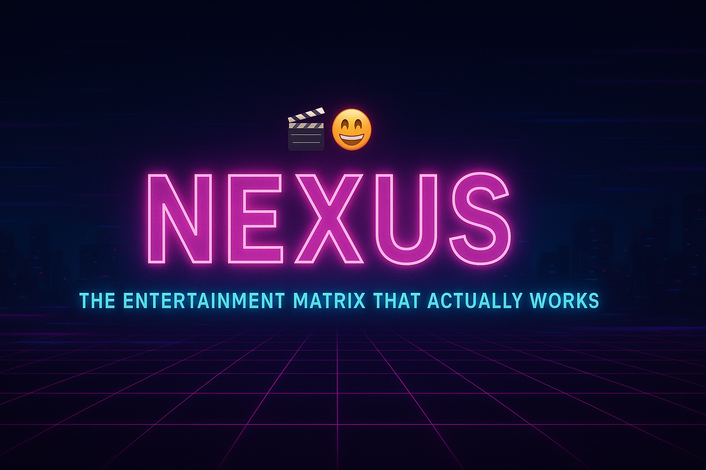

<h1 align="center">🎬 NEXUS — The Entertainment Matrix That Actually Works</h1>

<p align="center">
  <a href="https://reactjs.org/"></a>
  <a href="https://firebase.google.com/"></a>
  <a href="https://tailwindcss.com/"></a>
  <a href="https://vercel.com/"></a>
  <a href="https://iamnexus.vercel.app"></a>
</p>

<p align="center">
  **Remember those sketchy pirate streaming sites with 47 pop-ups, malware warnings, and a video player from 2003?**<br>
  Yeah, we don't do that here. That's *cringe*. 🤢<br>
  Welcome to **NEXUS** — where streaming meets the future. **It just hits different.** 🚀
</p>

---

## 🔗 Live Demo: Tap In Now!

### ➡️ [WATCH NOW — iamnexus.vercel.app](https://iamnexus.vercel.app) ⬅️

---

## 🤯 NEXUS: Why We're The Main Character

We're not just another site; we're the glow-up of online streaming. **No cap.**

<p align="center">
  
</p>

<p align="center">
    **Drake rejecting:** Sketchy sites with 100 ads, mid-UI, and mandatory malware. <br>
    **Drake approving:** NEXUS with Neural AI, buttery smooth UX, and *zero* buffing memes.
</p>

### 🧠 NEURAL AI — Your Personal Movie Therapist 🎯
This AI **gets your mood** and curates your perfect watchlist. It's not just genre-matching; it's vibe-matching.

| Feature | The Vibe |
| :--- | :--- |
| **Mood-Based Recs** | Understands your **vibe**, not just genres. |
| **Smarter Than Your Ex** | Remembers your **taste** (unlike your ex 😭). |
| **Conversational UX** | Talk naturally: "I want something romantic but not too cheesy" → AI: "Say less fam, here's your perfect match." |

---

## ✨ Features That Slap (The Arsenal)

We’ve packed everything you need and left the baggage behind.

<details><summary>🎥 Cinematic Experience</summary>

- **HD Movie & Series Vault:** A library that's always stacked.
- **Custom Player:** Fully custom video player built from scratch (**no janky iframes!**).
- **Smart Search:** Instant, lightning-fast results.
- **Smart Playback:** Seamless episode management & auto-play.

</details>

<details><summary>💡 AI & Brains</summary>

- **Neural AI Chat:** Mood-based recommendations on demand.
- **Quick Mood Buttons:** Instant vibe checks for faster suggestions.
- **Learning Algorithm:** It evolves with you and your taste.

</details>

<details><summary>🔐 User Flex</summary>

- **Secure Auth:** Firebase Auth — secure and fast sign-in.
- **History + Resume:** Never lose your spot.
- **Personal Vault:** Save your favorites, your way.
- **Viewing Stats:** Track your cinema journey.

</details>

<details><summary>🎨 Aesthetics & UX</summary>

- **Cyberpunk Dark Mode:** UI that's a total feast for the eyes.
- **Buttery Smooth:** Clean, ad-free interface with **Lenis scroll** and smooth transitions.
- **Responsive AF:** Fully responsive — from phone to fridge.
- **Speed Flex:** Optimized rendering, built for *grandma’s Wi-Fi speed*.

</details>

---

## 🛠️ The Stack: What We Used (It's Elite)

### ⚛️ Frontend
| Tech | Role |
| :--- | :--- |
| **React 18.2.0** | The core engine, obvs. |
| **Tailwind CSS 3.4+** | For that clean, utility-first styling. |
| **Redux Toolkit** | State management, keeping things tidy. |
| **Lenis Scroll** | For that *smooooth* scrolling experience. |

### 🔥 Backend & APIs
| Tech | Role |
| :--- | :--- |
| **Firebase Auth + Firestore** | Secure user management and data storage. |
| **VidSrc API** | Streaming data source. |
| **TMDB API** | Movie/Series metadata. |
| **Vercel** | Global, fast deployment. |

---

## ⚙️ Get It Running (Local Setup)

Wanna clone it? Here's the tea:

1.  **Clone the Repo:**
    ```bash
    git clone [https://github.com/whatsupsumit/The-Nexus.git](https://github.com/whatsupsumit/The-Nexus.git)
    cd The-Nexus
    ```

2.  **Install Dependencies:**
    ```bash
    npm install
    ```

3.  **Configure Environment:**
    ```bash
    cp .env.example .env
    ```
    🚨 **Heads Up:** Add your Firebase and TMDB credentials inside the newly created `.env` file. Don't expose your secrets!

4.  **Send It! (Start Dev Server):**
    ```bash
    npm start
    ```
    Then visit 👉 [http://localhost:3000](http://localhost:3000)

---

## 🎮 Pro Tips (Hidden Abilities)

- **AI Chat:** Talk naturally — "Make me laugh" **>** "Comedy".
- **Keyboard Shortcuts:** **Space** = Play/Pause, **F** = Fullscreen.
- **Vault:** Save movies to your personal "Must-Watch" list.
- **TV Mode:** Instant season & episode switching is clean.
- **Easter Eggs:** Try typing `konami code`, clicking the logo 10x, or searching “the cake is a lie”. 👀

---

## 🚀 Deployment: Go Live!

### 🪄 Vercel (The Move)
This is the recommended path for a zero-effort setup:
1.  Connect your GitHub repo to Vercel.
2.  Add your environment variables.
3.  Hit **Deploy** — done! **EZ.** 🎉

### 🧩 Manual Build
```bash
npm run build
---

## 🤝 Contributing (Pull Up!)

Found a bug or have a feature idea that's pure genius? **Pull Requests are welcome.**

1.  **Fork** this repo.
2.  Create your feature branch: `git checkout -b feature/your-feature-name`
3.  Commit your changes: `git commit -m "✨ Add a game-changing feature"`
4.  Push to the branch: `git push origin feature/your-feature-name`
5.  **Open a Pull Request** 🚀

---

## 🗺️ Roadmap: The Vision

| Status | Feature |
| :--- | :--- |
| **✅ Done** | Neural AI Chat |
| **✅ Done** | Custom Video Player |
| **✅ Done** | Responsive Redesign |
| **✅ Done** | Watch History + Vault |
| **🚀 Soon** | ⭐ Reviews |
| **🚀 Soon** | 🤝 Friend Watchlists |
| **🚀 Soon** | 📱 Offline Mode |
| **🚀 Soon** | 👥 Social Features (e.g., Live Sync Watch) |

---

## 📊 Flexing Our Performance Stats

We didn't just make it look good; we made it perform like a beast. 🦁

* **Lighthouse 95+** ⚡
* **Load Time** < 2s on mid-tier connection.
* **Time to Interactive** < 2.5s.
* **Security First:** Your data’s safer here than in Fort Knox. 🔒

---

## 💬 What The Fandom Says (Real Talk)

> “Finally, a streaming site that doesn’t give my PC COVID.”
>
> “Better UI than Netflix, **no cap.**”
>
> “The AI chat is lowkey genius.”

---

<div align="center">

### 🎬 Built with ❤️ and far too much ☕
**By [@whatsupsumit](https://github.com/whatsupsumit)**

⭐ Star this Repo | 🐛 Report Bug | ✨ Request Feature

**Last Updated:** October 2025 🚀
*"Not all heroes wear capes — some build fire streaming platforms."* 🦸‍♂️

</div>